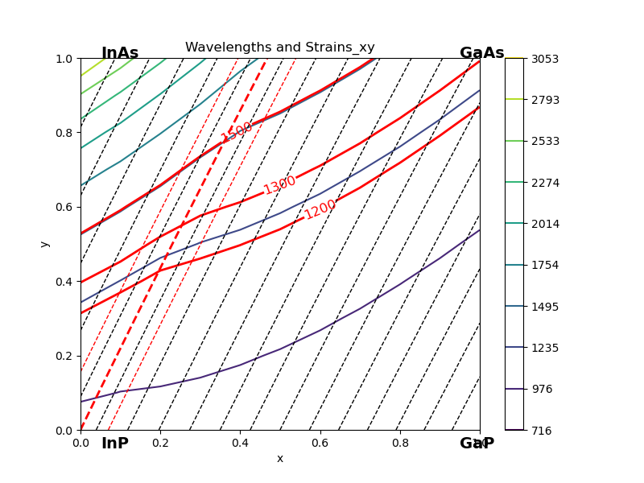
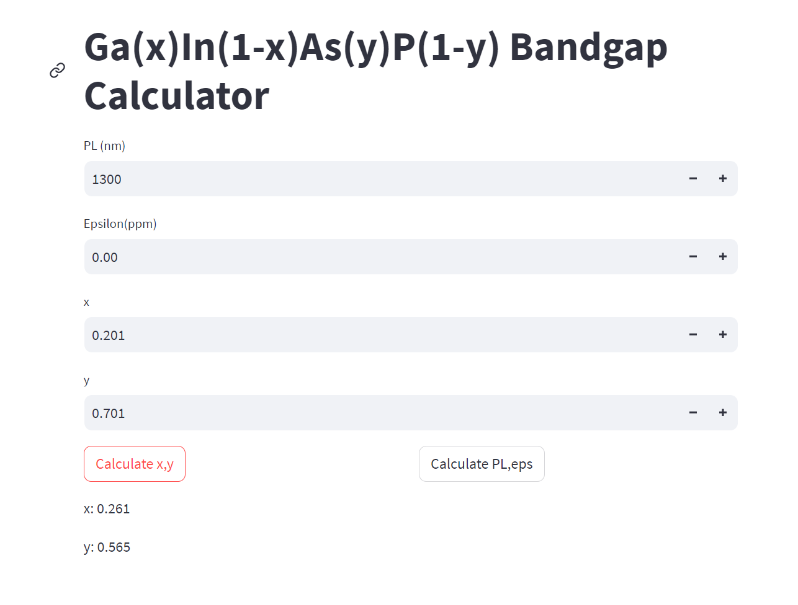
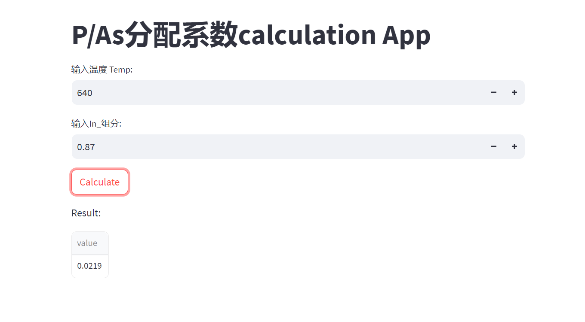

# InGaAsP
InGaAsP caculation

基于https://github.com/krzyklo/ingaasp2rcpp 项目

# pic
画出x,y和Wavelength，strain的关系图

# app

基于streamlit包，生成网页应用
已知PL和strain，计算x，y
已知x,y,计算PL和strain

---

已知温度和In组分，计算P/As分配系数

